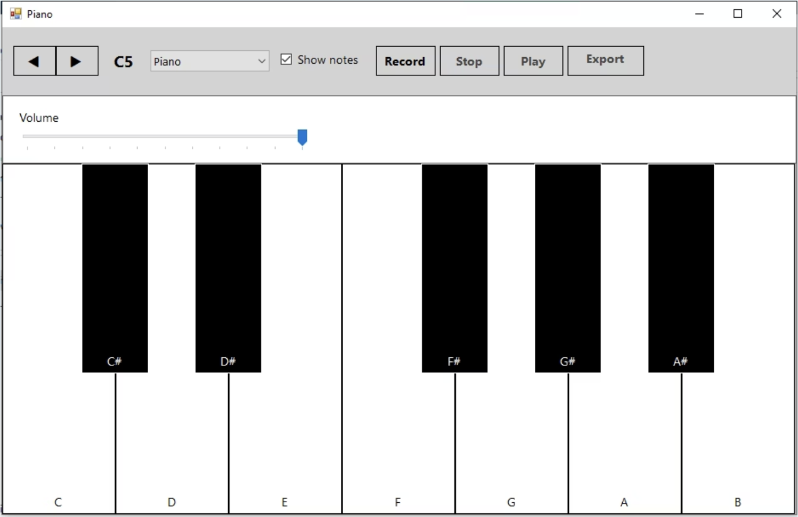
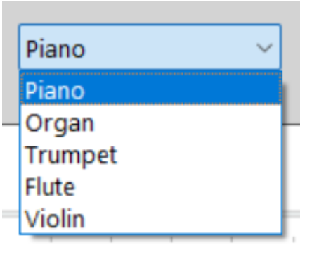

# 🎹 Virtual C# Electronic Piano


A feature-rich **Virtual Electronic Piano** desktop application developed in **C# / Windows Forms**. Built as a high school graduation diploma project, this application merges digital audio synthesis concepts, low-latency keyboard event handling, and an intuitive custom GUI.

---

## 📌 Project Preview

| Keyboard View & Controls | Sound Settings & Octave Shift |
| :---: | :---: |
|  |  |

---

## ✨ Key Features

- **🎹 Interactive Keyboard Interface:** Custom-drawn UI with mouse and hardware keyboard bindings for real-time playability.
- **⚡ Low-Latency Audio Playback:** Optimized event handling utilizing custom sound buffers to ensure minimal input lag during fast playing.
- **🎼 Octave Transposition & Pitch Controls:** Real-time pitch manipulation and octave switching dynamically mapped across keyboard registers.
- **🔊 Volume & Audio Effects Processing:** Built-in master volume slider and dynamic envelope adjustments.
- **💻 Cross-Platform Playability:** Runs natively on Windows and seamlessly on macOS Apple Silicon via Wine wrappers (Porting Kit / CrossOver).

---

## 🛠️ Architecture & Technical Highlights

Excerpted from the accompanying **30-page Diploma Project Documentation**:

### 1. Event-Driven Keyboard Mapping
The core application relies on Windows OS key hook events (`KeyDown` and `KeyUp`). A key challenge addressed in the architecture was avoiding keyboard auto-repeat delays while holding down piano keys, achieved through explicit key-state trackers.

[ Hardware Keyboard Input ] ---> [ WinForms Event Handlers (KeyDown/KeyUp) ]
|
v
[ Active Keys Dictionary ] <---> [ Audio Engine / Sound Pool ]
|
v
[ Direct Sound / Audio Output ]


### 2. Audio Processing Engine
- **Sound Management:** Audio files/waveforms are loaded into memory pools upon startup to prevent IO disk latency during real-time user interaction.
- **Concurrency:** Polyphonic sound reproduction allows overlapping notes without audio clipping or interruption.

---

## 📁 Repository Structure

.
├── docs/
│   ├── diploma_documentation.pdf   # Full 30-page thesis & theoretical framework
│   └── screenshots/                # Application UI images
├── Piano/                          # Visual Studio Solution & Source Code
│   ├── Form1.cs                    # Main Form logic & key bindings
│   ├── Form1.Designer.cs           # WinForms UI layout definitions
│   └── Piano.csproj                # C# Project File
├── .gitignore                      # VS & macOS cleanup rules
├── LICENSE                         # MIT License
└── README.md                       # Documentation


---

## 🚀 Getting Started

### Prerequisites
- **Windows:** [.NET Framework 4.7.2+](https://dotnet.microsoft.com/download/dotnet-framework)
- **macOS:** [Porting Kit](https://www.portingkit.com/) or CrossOver with `.NET Framework` installed inside the wrapper.

### Running from Source
1. Clone the repository:
   ```bash
   git clone [https://github.com/YOUR_GITHUB_USERNAME/Electronic-Piano-CSharp.git](https://github.com/YOUR_GITHUB_USERNAME/Electronic-Piano-CSharp.git)
Open Piano/Piano.sln in Visual Studio.
Build and run the solution (F5).
📑 Diploma Documentation
The complete 30-page documentation detailing the theoretical analysis of sound wave synthesis, C# class design, and algorithm architecture is available in the docs/ directory.

📜 License
Distributed under the MIT License. See LICENSE for more details.
